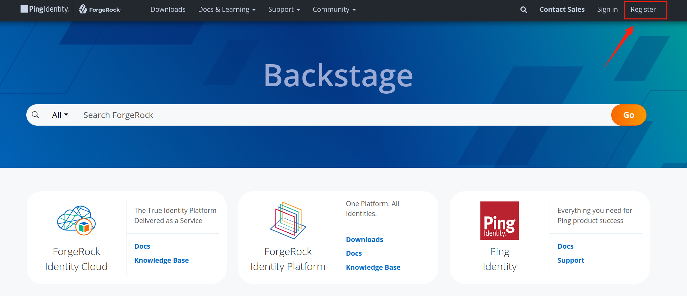
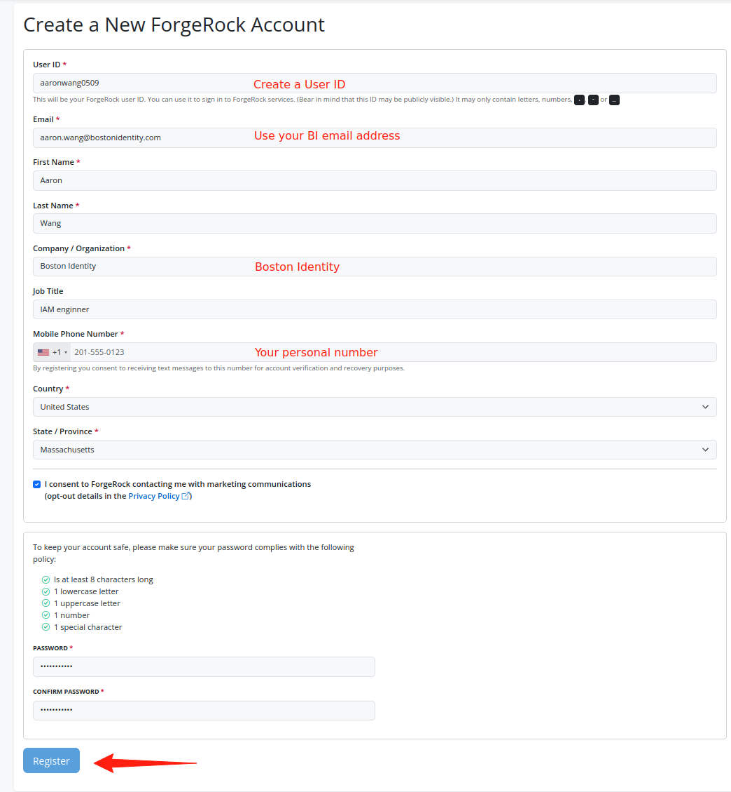
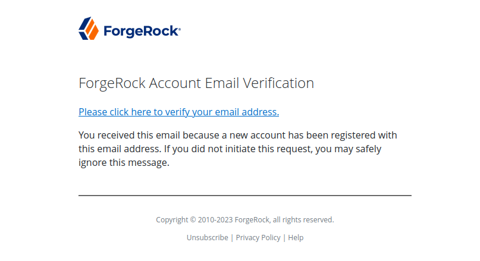

# ForgeRock Account Registration Guide

## Instructions

### Step 1: Access ForgeRock Backstage

1. Open your web browser and navigate to [ForgeRock Backstage](https://backstage.forgerock.com/).
2. Click on the **Register** button.

### Step 2: Fill in Registration Details

1. Fill in all the required details in the registration form. Make sure to use your Boston Identity email address.
2. Once all details are filled in, click the **Register** button.

### Step 3: Verify Your Email

1. Check your Boston Identity email inbox for a verification email from ForgeRock.
2. Click on the verification link provided in the email.

### Step 4: Complete Registration

1. After clicking the verification link, your registration will be complete.
2. You can now log in to ForgeRock Backstage using your registered credentials.
