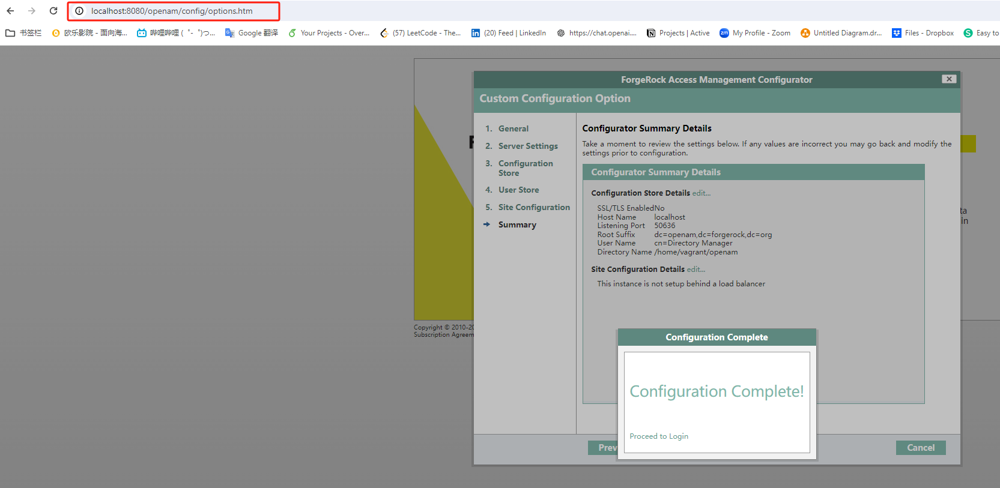

# Linux Environment Setup on Windows 10 Using CentOS 7

This guide is designed for Windows users who wish to set up a Linux development environment using CentOS 7. CentOS 7 is chosen for its stability and broad industry acceptance, making it a reliable choice for both development and production environments. This setup has been fully tested on Windows 10 to ensure compatibility and consistency.

## Prerequisites

Before you begin the setup, download and install the following tools:

### 1. VirtualBox
- **Download Link:** [VirtualBox Downloads](https://www.virtualbox.org/wiki/Downloads)
- **Description:** VirtualBox is a powerful x86 and AMD64/Intel64 virtualization product for enterprise as well as home use.

### 2. Vagrant
- **Download Link:** [Vagrant Downloads](https://developer.hashicorp.com/vagrant/downloads)
- **Note:** Download the AMD64 version.
- **Description:** Vagrant is an open-source software product for building and maintaining portable virtual software development environments.

### 3. WinSCP
- **Download Link:** [WinSCP Downloads](https://winscp.net/eng/download.php)
- **Description:** WinSCP is a popular SFTP client and FTP client for Microsoft Windows, providing safe copying of files between a local and a remote computer.

### 4. Git Bash
- **Download Link:** [Git for Windows](https://gitforwindows.org/)
- **Description:** Git for Windows provides a BASH emulation used to run Git from the command line.

### 5. Visual Studio Code (VS Code)
- **Download Link:** [VS Code](https://code.visualstudio.com/)
- **Description:** VS Code is a streamlined code editor with support for development operations like debugging, task running, and version control. We use it for editing files and run commands on the VM.

## Setup Steps

### Step 1: Set Up the Virtual Machine

Open PowerShell, and run the following commands to clone the repository and set up the CentOS 7 VM:

```shell
git clone https://github.com/aaronwang0509/forgerock_training_docs.git
cd .\forgerock_training_docs\VM_for_Win10\
vagrant plugin install vagrant-vbguest
vagrant up
```

This will set up a CentOS 7 VM. You can then log in using:

```shell
vagrant ssh
```


Then you can run the following command to check the VM:

```shell
sudo yum update -y
sudo yum install -y vim
```

### Set Up WinSCP for File Transfers

Retrieve SSH information of your VM:

```shell
vagrant ssh-config
```

Open WinSCP, select the SFTP protocol, and input the SSH information.


Under Advanced settings in SSH->Authentication, choose the private key file from .vagrant\machines\default\virtualbox.


Choose the private key file and confirm to convert the private key file to PPK format.


Then clink login, now you can transfer file between windows and VM.

You can save the session for future use.


### Step 3: Manage Ports

Because we don't have a GUI, so we need to use port management to access the service in VM.


```shell
# config.vm.network "forwarded_port", guest: 8080, host: 8080
```
Uncomment and modify the line as necessary to forward additional ports. After changes, run:

```shell
vagrant reload
```

VM will reastart, then you can access the service in VM by http://localhost:8080



### Step 4: Set Up VS Code for Remote Editing

Install the Remote SSH extension in VS Code. Click the blue icon in the lower left corner, select "Connect to Host", then "Config SSH Hosts". Select the SSH config file, e.g., C:\Users\***\.ssh\config.


Add the SSH configuration of the VM:

```shell
Host centos7
    HostName 127.0.0.1
    User vagrant
    Port 2222
    IdentityFile C:/Users/wangqiushi/Desktop/CentOS_Win10/forgerock_training_docs/VM_for_Win10/.vagrant/machines/default/virtualbox/private_key
    StrictHostKeyChecking no
    UserKnownHostsFile /dev/null
```
Change the IdentityFile to the private key file in .vagrant\machines\default\virtualbox, then save it.

Click the blue icon in the lower left corner, select "Connect to Host", then select 'centos7', and you can edit the files or run commands in VM.


